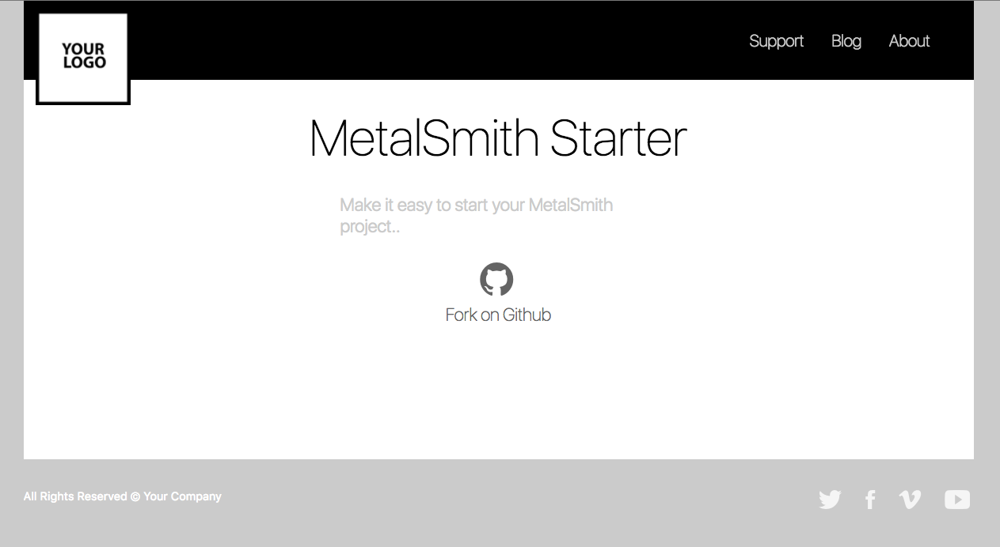

# MetalSmith Starter

[Check out the demo page.](https://metalsmith.leventebalogh.com)



## Table of Contents
- [Demo](https://metalsmith.leventebalogh.com)
- [Features](#features)
- [Dependencies](#dependencies)
- [Setup](#setup)
- [Development](#development)
- [Deploy](#deploy)
- [Directory Structure](#directory-structure)

## Features
- SASS Support (just include your files in `src/styles/main.scss`)
- Watch file changes and rebuild (`$ yarn dev`)
- Serve build directory (`$ yarn serve`)
- Favicon example
- Manifest.json example
- Easy-to-use deploy script

## Dependencies
To build and develop the project you will need the following dependencies:
- [Node.js](https://nodejs.org/en/)
- [NPM](https://www.npmjs.com/)
- [Yarn](https://yarnpkg.com/lang/en/) (Optional)

## Setup
I am using `yarn` throughout the docs, although you can safely use `npm` instead.

```bash
# Install dependencies
$ yarn

# Build site
$ yarn build
```

## Development
```bash
# Build project
$ yarn build

# Serve built project (View on http://localhost:8080)
$ yarn serve

# Watch files for changes (and re-build on any change)
$ yarn dev

# Clean build directory
$ yarn run clean
```

## Deploy
Deploy is made easy with [ANSIBLE](https://www.ansible.com/).

You need to install ANSIBLE first:
```bash
# OS X
$ brew install ansible

# Ubuntu
$ sudo apt-add-repository ppa:ansible/ansible
$ sudo apt-get update
$ sudo apt-get install ansible
```

Customise the following files first:

**"ansible/hosts"** <br />
Change `leventebalogh.com` to your hostname, and also change the `ansible_user` to the
user you use on your machine.
Make sure you have the proper SSH keys loaded to login to the host.
```bash
[vps]
leventebalogh.com ansible_user=www
```

**"ansible/playbook"** <br />
No need to touch this one.

**"ansible/roles/deploy/tasks/main.yml"** <br />
Change `~/metalsmith` to the directory where you would like to host the `build` output from.
```yml
- name: Copy build output
  synchronize:
    src: ../../../build
    dest: ~/metalsmith
```

**Run to Deploy:**
```bash
$ ./deploy.sh
```

## Directory Structure
```bash
+- ansible/ # ANSIBLE config files
+- build/ # The static build output
+- gulp/ # Gulp task files
+- src/
    +- content/ # All the static content written in Markdown
    +- layouts/ # Layout components in Handlebars templates
    +- styles/ # Styling in SASS files
+- config.js # Going to hold project specific configuration
+- deploy.sh # Executable script to easily deploy the project
```